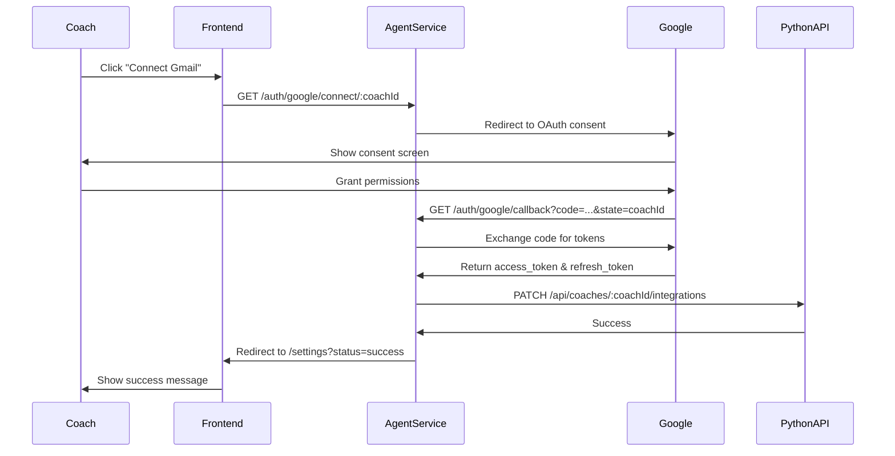

# Google OAuth2 Integration for Gmail

This module implements the Google OAuth2 flow to allow coaches to connect their Gmail accounts to SquashDaddy.

## Overview

The integration allows coaches to:
1. Authorize SquashDaddy to access their Gmail account
2. Securely store their refresh token in the database
3. Enable the AI agent to read and respond to emails on their behalf

## Architecture

### Components

- **GoogleAuthService** (`google-auth.service.ts`): Handles OAuth2 client configuration and token exchange
- **GoogleAuthController** (`google-auth.controller.ts`): Provides REST endpoints for the OAuth flow
- **AuthModule** (`auth.module.ts`): Encapsulates auth-related dependencies

### OAuth Flow



## Environment Variables

Configure the following in your `.env` file:

```bash
# Google OAuth2 Credentials
GMAIL_CLIENT_ID=your-client-id.apps.googleusercontent.com
GMAIL_CLIENT_SECRET=your-client-secret
GMAIL_REDIRECT_URI=http://localhost:3001/auth/google/callback

# Frontend URL for post-auth redirects
FRONTEND_URL=http://localhost:3000

# Python API (backend URL)
PYTHON_API_URL=http://localhost:8000
```

## API Endpoints

### 1. Initiate OAuth Flow

```
GET /auth/google/connect/:coachId
```

**Parameters:**
- `coachId` (path): The ID of the coach to authenticate

**Response:** Redirects to Google OAuth consent screen

**Example:**
```bash
curl -L http://localhost:3001/auth/google/connect/coach-123
```

### 2. OAuth Callback

```
GET /auth/google/callback
```

**Parameters:**
- `code` (query): Authorization code from Google
- `state` (query): The coachId passed through the OAuth flow

**Response:** Redirects to frontend with status

**Success:** `http://localhost:3000/settings?status=success`
**Error:** `http://localhost:3000/settings?status=error&message=<error_type>`

## Error Handling

The implementation handles several error scenarios:

| Error Type | Description | Redirect URL |
|------------|-------------|--------------|
| `oauth_init_failed` | Failed to generate auth URL | `/settings?status=error&message=oauth_init_failed` |
| `missing_parameters` | Missing code or state in callback | `/settings?status=error&message=missing_parameters` |
| `no_refresh_token` | Google didn't return refresh token (user already authorized) | `/settings?status=error&message=no_refresh_token` |
| `callback_failed` | General callback error (API failure, etc.) | `/settings?status=error&message=callback_failed` |

### Handling "No Refresh Token"

If a user has already authorized the app, Google may not return a refresh token on subsequent authorizations. To resolve:

1. User must revoke access at: https://myaccount.google.com/permissions
2. Try connecting again

The implementation uses `prompt=consent` to minimize this issue by always showing the consent screen.

## Security Considerations

### State Parameter

Currently, the `coachId` is passed as plain text in the `state` parameter. For production:

```typescript
// Recommended: Sign or encrypt the state parameter
const state = jwt.sign({ coachId }, SECRET_KEY, { expiresIn: '10m' });

// In callback, verify the signature
const { coachId } = jwt.verify(state, SECRET_KEY);
```

### Scopes

The implementation requests the minimum required scope:

- `https://www.googleapis.com/auth/gmail.modify` - Read, compose, send, and modify emails

## Testing

Run unit tests:

```bash
npm test -- google-auth
```

### Test Coverage

- ✅ OAuth2 client initialization
- ✅ Auth URL generation with correct parameters
- ✅ Successful callback handling
- ✅ Missing refresh token scenario
- ✅ Error handling for missing parameters
- ✅ Python API integration errors

## Integration with Python API

The service calls the Python API to persist the refresh token:

```http
PATCH /api/coaches/{coachId}/integrations
Content-Type: application/json

{
  "gmail_refresh_token": "1//0gxxxxxxxxxxxxxxxxxxxxxxxxxx"
}
```

Ensure this endpoint exists in your Python backend.

## Usage in Frontend

### Initiate Connection

```typescript
const handleConnectGmail = () => {
  const coachId = getCurrentCoachId();
  window.location.href = `http://localhost:3001/auth/google/connect/${coachId}`;
};
```

### Handle Callback

```typescript
// In /settings page
const searchParams = new URLSearchParams(window.location.search);
const status = searchParams.get('status');
const message = searchParams.get('message');

if (status === 'success') {
  toast.success('Gmail connected successfully!');
} else if (status === 'error') {
  const errorMessages = {
    no_refresh_token: 'Please revoke app access and try again',
    oauth_init_failed: 'Failed to start OAuth flow',
    missing_parameters: 'Invalid OAuth response',
    callback_failed: 'Failed to save credentials',
  };
  toast.error(errorMessages[message] || 'Connection failed');
}
```

## Troubleshooting

### Build fails with OAuth2Client errors

Ensure `googleapis` is installed:

```bash
npm install googleapis
```

### Tests timeout

The token exchange tests may require mocking Google's API. Use `nock` for HTTP mocking:

```bash
npm install --save-dev nock
```

### Redirect URI mismatch

Ensure the `GMAIL_REDIRECT_URI` in your `.env` matches exactly what's configured in Google Cloud Console:

1. Go to: https://console.cloud.google.com/apis/credentials
2. Select your OAuth 2.0 Client ID
3. Add authorized redirect URI: `http://localhost:3001/auth/google/callback`

## Next Steps

1. **Frontend Integration**: Create UI component for Gmail connection
2. **State Encryption**: Implement JWT signing for state parameter
3. **Token Refresh**: Implement auto-refresh logic when access tokens expire
4. **Webhook Setup**: Configure Gmail push notifications for real-time email monitoring
